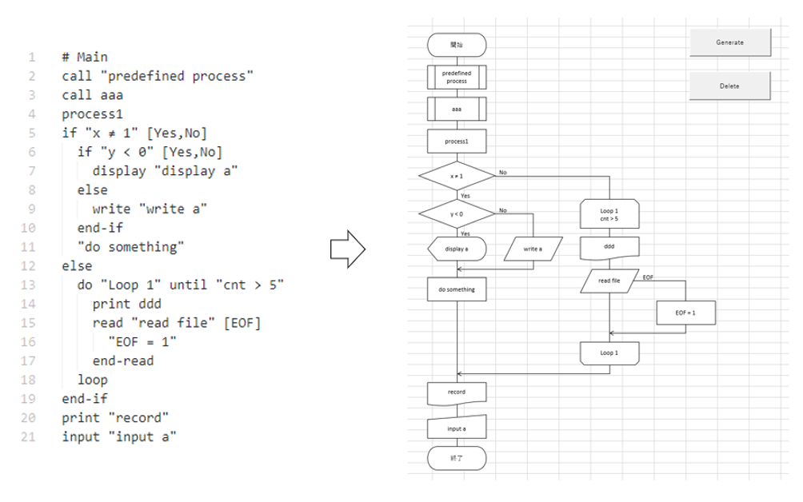

# flowchart-generator

## 概要
フローを記述したテキストファイルを入力として、エクセルの図形でフローチャートを作成する。



## 使い方
### テキストファイルの準備
以下のルールで記述。`sample/flowchart.txt`を参考のこと。

#### String
文字列は空白を含む場合、`" "`でくくる。`"`のエスケープには未対応。
```
aaa
"aaa"
"aaa bbb ccc"
```

#### Statement
- フローチャート開始
  ```
  # <string>
  ```
- 処理
  ```
  <string>
  ```
- 定義済処理
  ```
  call <string>
  ```
- 条件分岐
  ```
  if <string> [label1,label2]
    {<statement>} | continue
  else
    {<statement>}
  end-if

  if <string> [label1,label2]
    {<statement>}
  end-if
  ```
- 繰り返し
  ```
  do <string> until <string>
    {<statement>}
  loop

  do <string>
    {<statement>}
  loop until <string>
  ```
- データ
  ```
  read <string> [label]
    {<statement>}
  end-read

  read <string>

  write <string>
  ```
- 書類
  ```
  print <string>
  ```
- 表示
  ```
  display <string>
  ```
- 入力
  ```
  input <string>
  ```

### フローチャートの作成
- `FlowChartGenerator.xlsm`と同じフォルダに、用意したファイルを`flowchart.txt`というファイル名でおく。
- Excelファイルを開き、`Generate`ボタンをクリックする。

## 備考
xlsmからのソースコード抽出には、[vbac](https://github.com/vbaidiot/ariawase)を使用。
